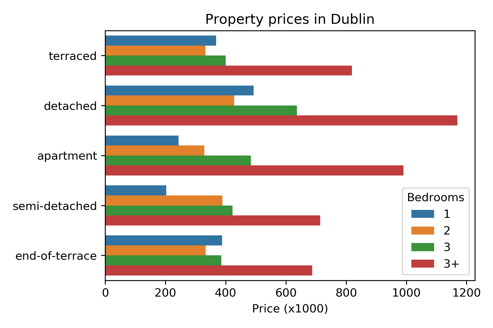
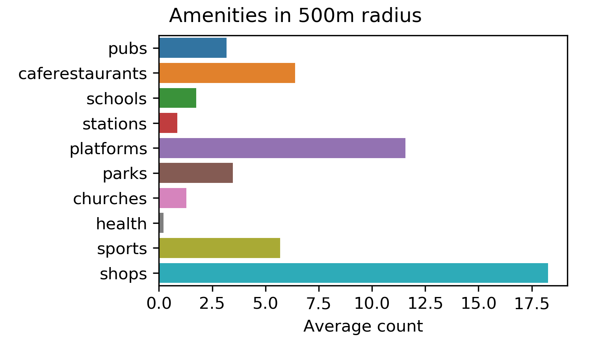

# Daft.ie webscraping
Webscraping [daft.ie](http://www.daft.ie), the well-known property listing website of Ireland. The plot below shows average prices by property type and the number of bedrooms.

 
 

The data is matched to data from [openstreetmap.org](http://www.openstreetmap.org) on the basis of latitude and longitude. The plot below shows the average number of amenities in a 500 meter radius around a property

